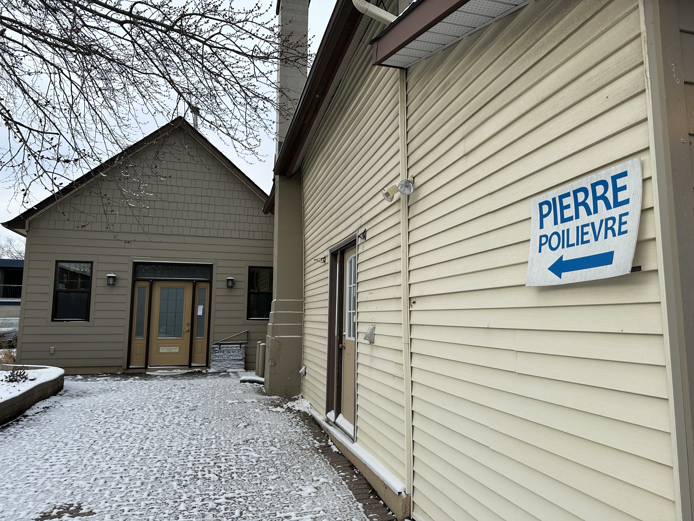

**December 21st 2023** 
**CMN 4100 - Digital Journalism 2** 
**Téana Averbeck** 
**Presented to Professor Jean-Sébastien Marier,BA,MJ** 

# Take-Home Exam: Data-Driven Multimedia Story

## 1. Introduction

Access to information and privacy (ATIP) is an act under the government of Canada which gives any Canadian citizen, permanent resident or any person or corporation residing in Canada the right to access records belonging to any government institution which also includes personal information held by these government institutions (Government of Canada, 2023). Examples of records that may be requested include but are not limited to: Briefing notes, memos, reports, Correspondences (including emails), Financial reports, etc. All summaries of record requests are publicly available information and available as a Government of Canada dataset. As this dataset is rather large in size, I decided to focus only on all ATIP requests for Crown Corporations in 2023. Crown Corporations are essentially government organizations that, while representing governmental interests, have a large measure of autonomy that allows them to function as a commercial entity. This model allows the organization to function as a hybrid of both the private and public sector. The main focus of my research was to determine which Crown Corporations had the most ATIP requests, and for those requests how many records were all disclosed, disclosed in part, all excluded, all exempt and no records exist (Government of Canada, 2023). Furthermore, I wanted to use this discovered data to analyze any potential trends and examine if there was any reasoning behind trends in results of how much or how little information was released.

*Figure 1: Parliament Hill.*

## 2. Data Cleaning

In order for the data to be transparent, it is important to highlight the methodology used to clean the dataset. The original dataset I had exported from the Government of Canada into Google Sheets contained all ATIP request summaries from 2011-2023 inclusively. As this dataset was enormous, I decided to narrow down my search and only focus on the 2023 requests thus far, thus I created filters to identify all years prior to 2023 then deleted them all. To make all of the information clearer I subsequently:

`1.` Froze the top columns;
`2.` Used a filter to organize the months in order (‘Sort A-Z’);
`3.` Removed all the french using `=SPLIT(M2,"|")` then dragging the formula for the rest of the columns to ensure all the columns are split equally and are all uniform;
`4.` Copy pasted both new columns that were a result of the Split function, then deleted the french and the original column; 
`5.` Deleted all french language by deleting the columns summary_fr and comments_fr;
`6.` Hid the summary_en column as it provided immense unnecessary detail;
`7.` Remove all agencies that are not Crown Corporations according to the [Treasury Board of Canada Secretariat.](https://www.canada.ca/en/treasury-board-secretariat/services/guidance-crown-corporations/list-crown-corporations.html)

After completing all these steps, my dataset resembled this:

*Figure 2: Sheets Dataset after data cleaning*

Using this new dataset, I created a pivot table with each crown corporation in the y axis, each type of record disclosure (all disclosed, disclosed in part, all excluded, all exempt and no records exist) in the x-axis and all the request summaries as the values in the middle of the table. I then used this pivot table to create a multiple pie chart of all the Crown Corporations in order to illustrate the different types of record disclosure proper to each Crown Corporation in addition to demonstrating which had more/less ATIP requests in 2023.

 
*Figure 3: ATIP requests for all Crown Corporations divided by dispositions in 2023. [Interactive version here](https://datawrapper.dwcdn.net/JgLF2/3/)*

## 3. Leveraging the data to find information

Looking at this new dataset in a visual form allows us to see clearly what request types are most recurring, which visually appeared to be disclosed in part. Furthermore, the new dataset and chart tells us that the National Capital Commission was the Crown Corporation with the most ATIP requests for 2023 so far, totalling 87 requests with 57 of these requests being disclosed in part, 22 all disclosed and 8 exempt. 

*Figure 4: Breakdown of all ATIP record requests for the National Capital Commission in 2023 thus far. [Interactive version here](https://datawrapper.dwcdn.net/slM75/1/)*

To gain a better understanding of the National Capital Commision’s ATIP requests procedure, I sat down with Alain Belleville, the Access to Information and Privacy Coordinator at the National Capital Commission (NCC). Belleville outlined the lengthy, yet thorough process that is conducted once an ATIP request is placed. Essentially, when someone from the public makes a request by either sending the NCC an email or letter, or can go through the Treasury Board of Canada Secretariat’s online portal, subsequently an analyst from the NCC then ensures the request form is properly filled out and that they properly understand the request. The analyst then removes any duplicate records, ensures that all the records are responsive and looks to see if anything is missing. Next, the analyst consults with the third parties and other governments to see which information they can/cannot release. After the analyst completes this portion, it is then usually given to Belleville, to approve the application and any release of information/exemptions. Belleville explains that there are two types of exemptions, mandatory, where it must be excluded and discretionary, where the analyst and Belleville may choose to release it or not. In regards to the percentage of ATIP requests that are disclosed, Belleville explained that the majority of records that may be only partially disclosed may not be properly representative of how much information is disclosed. He explains that even if a small phrase is excluded it becomes classified as partially disclosed. As the NCC operates with a policy of attempting to provide the most information possible, it is plausible to recognize that non disclosed information in the partially disclosed category may only represent a small percentage of information that is truly not disclosed. 

*Figure 5: Screenshot of interview with Alain Belleville conducted via Microsoft Teams.*

*Figure 6: The National Capital Commission Building (yellow building) behind a coffee shop (burgundy building).*

## 3. Looking ahead: ATIP requests change in legislation

*Figure 7: Pierre Poilievre's office in Manotick, Ontario.*

*Figure 8: Manotick, a suburb of Ottawa Ontario.*

## 4. Additional Resources

To create an ATIP Request please visit [the Treasury Board of Canada Secretariat website](https://www.canada.ca/en/treasury-board-secretariat/services/access-information-privacy/access-information/request-information/types-atip-requests.html). 

## 5. References

Government of Canada. (2023, November 23). Open government​. Open Government - Government of Canada. https://open.canada.ca/en 

The Law Society of Ontario. (2023). Biographies of Early and Exceptional Ontario Lawyers of Diverse Communities Arranged By Diverse Community. The Law Society of Ontario. https://lso.ca/about-lso/osgoode-hall-and-ontario-legal-heritage/collections-and-research/online-resources-and-finding-aids/diversifying-the-bar-lawyers-make-history/biographies-diverse-community 

Treasury Board of Canada Secretariat, Government of Canada. (2022, November 29). List of Crown corporations. Canada.ca. https://www.canada.ca/en/treasury-board-secretariat/services/guidance-crown-corporations/list-crown-corporations.html 

Treasury Board of Canada Secretariat, Government of Canada. (2023, December 18). Make an access to information or personal information request. Canada.ca. https://www.canada.ca/en/treasury-board-secretariat/services/access-information-privacy/access-information/request-information.html  

